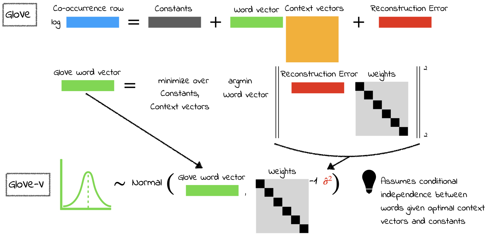

# Statistical Uncertainty in Word Embeddings: GloVe-V
**Andrea Vallebueno, Cassandra Handan-Nader, Christopher D. Manning, Daniel E. Ho**

This is the code repository for the paper "Statistical Uncertainty in Word Embeddings: GloVe-V". Our preprint is available [here](https://arxiv.org/abs/2406.12165).

**We introduce a method to obtain approximate, easy-to-use, and scalable uncertainty estimates for the GloVe word embeddings and demonstrate its usefulness in natural language tasks and computational social science analysis. This code repository contains code to download pre-computed GloVe embeddings and GloVe-V variances for several corpora from our HuggingFace repository, to interact with these data products and propagate uncertainty to downstream tasks.**



## Available Corpora

We provide embeddings and variances for the following corpora:

- **Toy Corpus (300-dim)**: a subset of 11 words from the Corpus of Historical American English (1900-1999). Downloadable as `Toy-Embeddings`
- **Corpus of Historical American English (COHA) (1900-1999) (300-dim)**: Downloadable as `COHA_1900-1999_300d`
- More to come!

## HuggingFace Repository
We store our data products on HuggingFace. You can find them [here](https://huggingface.co/datasets/reglab/glove-v).

Each dataset contains the following files (see the **Storage of GloVe-V Variances** section below for more details on the differences between the complete and approximated variances):
- `vocab.txt`: a list of the words in the corpus with associated frequencies
- `vectors.safetensors`: a safetensors file containing the embeddings for each word in the corpus
- `complete_chunk_{i}.safetensors`: a set of safetensors file containing the complete variances for each word in the corpus. These variances are size $D \times D$, where $D$ is the embedding dimensionality, and thus are very storage-intensive.
- `approx_info.txt`: a text file containing information on the approximation used to approximate the full variance of each word (diagonal approximation, or SVD approximation)
- `ApproximationVariances.safetensors`: a safetensors file containing the approximation variances for each word in the corpus. These approximations require storing much fewer floating point numbers than the full variances. If a word has been approximated by a diagonal approximation, then this file will contain only $D$ floating point numbers for each word. Alternatively, if a word has been approximated by an SVD approximation of rank $k$, then this file will contain $k(2D + 1)$ floating point numbers for each word.

If using the approximated variances, the `glove_v.variance.load_variance` function automatically handles the reconstruction of the variances from these files.

## Storage of GloVe-V Variances

Let $V$ be the size of the vocabulary and $D$ be the embedding dimension. While GloVe embeddings only require storing $V \times D$ floating point numbers, the GloVe-V variances require storing $V \times (D x D)$ floating point numbers. For this reason, we offer two download options:

1. **Approximation Variances**: These are approximations to the full GloVe-V variances that can use either a diagonal approximation to the full variance, or a low-rank Singular Value Decomposition (SVD) approximation. We optimize this approximation at the level of each word to guarantee at least 90% reconstruction of the original variance. These approximations require storing much fewer floating point numbers than the full variances.
2. **Complete Variances**: These are the full GloVe-V variances, which require storing $V \times (D x D)$ floating point numbers. For example, in the case of the 300-dimensional embeddings for the COHA (1900-1999) corpus, this would be approximately 6.4 billion floating point numbers!

Our [tutorial](https://github.com/reglab/glove-v/blob/main/glove_v/docs/tutorial.ipynb) compares results using the approximated and complete variances with an illustration from the paper.

## Setup

First, clone this repo:

```bash
git clone https://github.com/reglab/glove-v.git glove_v
```

Next, install uv:

```bash
curl -LsSf https://astral.sh/uv/install.sh | sh
```

Then, create a virtual environment:

```bash
cd glove_v
uv venv  # optionally add --python 3.11 or another version
```

To activate the virtual environment:

```bash
source .venv/bin/activate # If using fish shell, use `source .venv/bin/activate.fish` instead

uv sync
```

## Usage

Our tutorial notebook is available [here](https://github.com/reglab/glove-v/blob/main/glove_v/docs/tutorial.ipynb) and offers a more detailed walkthrough of the process of downloading and interacting with the GloVe-V data products.

Here is a quick example of how to download the approximated embeddings for the Toy Corpus:

```python
glove_v.data.download_embeddings(
    embedding_name='Toy-Embeddings',
    approximation=True,
)
```

We can easily load the vocabulary and embeddings for the Toy Corpus in several formats (dictionary, numpy arrays, gensim KeyedVectors):
```python
vocab, ivocab = glove_v.vector.load_vocab(
    embedding_name='Toy-Embeddings',
)
vectors = glove_v.vector.load_vectors(
    embedding_name='Toy-Embeddings',
    format='dictionary'
)
```

Next, we load the approximated variances for the Toy Corpus. This function automatically handles the reconstruction of the variances from the approximated files, such that the variances in the `approx_variances` dictionary are of size $D \times D$.

```python
approx_variances = {}
for word in list(vocab.keys()):
    approx_variances[word] = glove_v.variance.load_variance(
        embedding_name='Toy-Embeddings',
        approximation=True,
        word_idx=vocab[word],
    )
```

We also offer a Gensim integration for working with GloVe-V embeddings using Gensim's KeyedVectors.

```python
gensim_glovev_kv = glove_v.GloVeVKeyedVectors(
    embedding_name='Toy-Embeddings',
)
```
